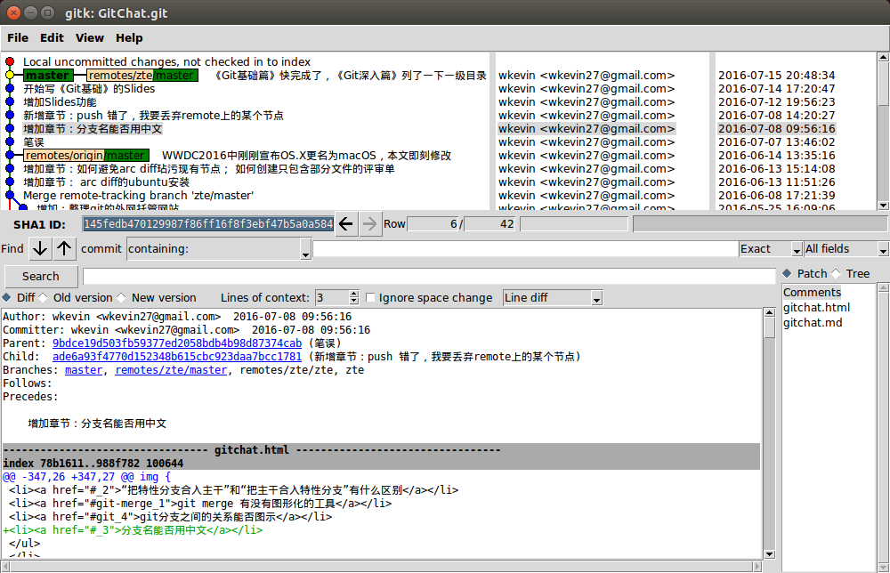

% <br>Git 基础篇
% wkevin
% ZTE

# Slides 操作提示<br><br>请按空格键

##


|按键|效果|
|---|---|
|PageDown/PageUp|一维向后/前遍历每张Slides|
|空格/Shift+空格<br>鼠标滚轮|向后/前播放历史中的每张Slides|
|上/下/左/右箭头|二维展示每张Slides|
|Esc/o|二维显示Slides地图<br>箭头：移动<br>Enter：选中|
|   |   |

<aside class="notes">
此段内容只有在speaker模式下的NOTES窗口可以看到。
's'进入speaker模式。
</aside>

<br><br>
<h1>请按 Esc 键</h1>

# 源起

## VCS (Version Control System)

* **SCCS**(Source Code Control System) -- 1970+, M.J.Rochkind
* **RCS**(Revision Control System) -- 1980+, Walter F. Tichy
* **CVS**(Concurrent Version System) -- 1986, Dick Grune
* **SVN**(Subversion) -- 2001
* **BitKeeper**
* **Mercurial**
* **Git** -- 2005.4, Linus Torvalds


## Git从何而来


* [Linux创始人Linus Torvalds访谈，Git的十年之旅](http://www.wtoutiao.com/a/2287349.html) 
* [Git 诞生记](http://www.liaoxuefeng.com/wiki/0013739516305929606dd18361248578c67b8067c8c017b000/00137402760310626208b4f695940a49e5348b689d095fc000)
* [BitKeeper与Git的恩怨情仇](http://www.path8.net/tn/archives/6039) 

## Git去往何处

2005年7月26日开始，Torvalds把Git托付给了一位日本人：[Junio Hamano](https://en.wikipedia.org/wiki/Junio_Hamano)。Torvalds也说过自己一生最大的成功之一就包括把git托付给Hamano。

Hamano现在google，他的github帐号为：[gitster](https://github.com/gitster)。


## 官方Specification

* [Git Man Page](https://www.kernel.org/pub/software/scm/git/docs/): 即： git help
* [Git User Manual](https://www.kernel.org/pub/software/scm/git/docs/user-manual.html)
* Git Tutorial
    - [Part1](https://www.kernel.org/pub/software/scm/git/docs/gittutorial.html) -- 即 man gittutorial
    - [Part2](https://www.kernel.org/pub/software/scm/git/docs/gittutorial-2.html) -- 即 man gittutorial-2
* [How to](https://www.kernel.org/pub/software/scm/git/docs/howto/)

## Book

* Pro Git
    - 第2版：[中文官方在线版](http://git-scm.com/book/zh/v2)、[中文国内在线版](http://www.kancloud.cn/kancloud/progit)、[英文官方在线版](http://git-scm.com/book/en/v2)
    - 第1版：[中文官方在线版](http://git-scm.com/book/zh/v1)、[中文国内在线版](http://git.oschina.net/progit/)
* [Git Community Book 中文版](http://gitbook.liuhui998.com/index.html)
* [Version Control with Git,《Git版本控制》](https://book.douban.com/subject/3405742/)
* [git简明教程](http://www.liaoxuefeng.com/wiki/0013739516305929606dd18361248578c67b8067c8c017b000)

## Website

* [git-scm.com](http://git-scm.com)
* [git 维基百科](https://en.wikipedia.org/wiki/Git_(software))
* [git SCM wiki](http://git.wiki.kernel.org) -- 2011年已停止更新

## github上Git的卓越组织

* [git](https://github.com/git):
    - 目前有[8位成员](https://github.com/orgs/git/people)，牵头人 [Scott Chacon](https://github.com/schacon)，他们充当管理者和传教士的角色
    - 比较重要的贡献是：
        - 维护git源码
            + Hamano(gitster)并没有加入到这个Orgnization中，而只是fork到自己账号下，然后PR到 git/git，看来gitster只是想当程序员，不想当管理者和传教士——大概源于日本人和中国人类似，都比较低调。
        - 管理和维护 [git-scm.com](http://git-scm.com) 网站
* [progit](https://github.com/progit)
    - 目前有[15位成员](https://github.com/orgs/progit/people)，牵头人 [Scott Chacon](https://github.com/schacon) 和 [Ben Straub](https://github.com/ben)，两人目前都供职于github公司，其他人多是从事翻译工作。
    - 比较重要的贡献
        - 写了《Pro git》这本书，此书被翻译成多种语言，被奉为经典。


# Git 常用命令

## git help 给出的关键命令

```bash
$ git help
   add        Add file contents to the index
   bisect     Find by binary search the change that introduced a bug
   branch     List, create, or delete branches
   checkout   Checkout a branch or paths to the working tree
   clone      Clone a repository into a new directory
   commit     Record changes to the repository
   diff       Show changes between commits, commit and working tree, etc
   fetch      Download objects and refs from another repository
   grep       Print lines matching a pattern
   init       Create an empty Git repository or reinitialize an existing one
   log        Show commit logs
   merge      Join two or more development histories together
   mv         Move or rename a file, a directory, or a symlink
   pull       Fetch from and integrate with another repository or local branch
   push       Update remote refs along with associated objects
   rebase     Forward-port local commits to the updated upstream head
   reset      Reset current HEAD to the specified state
   rm         Remove files from the working tree and from the index
   show       Show various types of objects
   status     Show the working tree status
   tag        Create, list, delete or verify a tag object signed with GPG
```

## Practice

>快速记忆，请写出至少5个git的命令

## Git的逻辑分区及几个关键命令


## Practice

>请绘出上页的图

## wkevin版的绘图


# Git my diary<br>一个完整的日记示例


## 最基本的两个配置：name 和 email
```bash
$ git config --global user.name wkevin
$ git config --global user.emal wkevin27@gmail.com
```

## 创建一个文件夹并写一篇日记
```bash
MBP:demo wangkevin$ mkdir mydiary
MBP:demo wangkevin$ cd mydiary
$ cat >diary.md
# Diary

## 2016.1.31
回家过年^C
$ ls
diary.md
$ cat diary.md 
# Diary

## 2016.1.31
回家过年
```

## git init 在文件夹中创建git库
```bash
$ git init
Initialized empty Git repository in /Users/wangkevin/workspace/demo/mydiary/.git/
```

## 和SVN有.svn类似，git也有.git
```bash
$ ls -a
.       ..      .git        diary.md
$ ls .git
HEAD        config      hooks       objects
branches    description info        refs
$ cat .git/config
[core]
    repositoryformatversion = 0
    filemode = true
    bare = false
    logallrefupdates = true
    ignorecase = true
    precomposeunicode = true
```

## git status 查看当前状态

```bash
$ git status
On branch master

Initial commit

Untracked files:
  (use "git add <file>..." to include in what will be committed)

    diary.md

nothing added to commit but untracked files present (use "git add" to track)
```

显示一个未被管控的文件(Untracked files) diary.md

## git add filename 将文件纳入管理

```bash
$ git add diary.md 
```

filename 支持通配符，最常用的就是点(.)表示所有文件

## git status

```bash
$ git status
On branch master

Initial commit

Changes to be committed:
  (use "git rm --cached <file>..." to unstage)

    new file:   diary.md
```

显示此文件待提交（to be committed），此时文件已经开始被git管理了，文件进入一种暂存状态（stage），如果想反悔可以用`git rm --cached`使其进入unstage状态

## git status -sb

-s/--short 短模式

```bash
$ git status -s
A  diary.md
```

-b/--branch 显示分支

```bash
$ git status -sb
## Initial commit on master
A  diary.md
```

`git status`不带参数默认就是-b的，所以常和短模式合作，合并为一个sb，哈哈

## git commit 将文件从暂存态提交入库

```bash
$ git commit
aster (root-commit) 14dd781] create mydiary
 1 file changed, 4 insertions(+)
 create mode 100644 diary.md
```

暂存就像回收站（删除前给你一个check的机会，多次操作放入回收站的文件可以一次清空），多次操作放入暂存，最后考虑成熟了，check OK了，再commit提交

## 编辑 log message

```bash
  1 
  2 # Please enter the commit message for your changes. Lines starting
  3 # with '#' will be ignored, and an empty message aborts the commit.
  4 # On branch master
  5 #
  6 # Initial commit
  7 #
  8 # Changes to be committed:
  9 #   new file:   diary.md
 10 #
```

执行 `git commit` 后会自动打开一个编辑器（编辑器是可配置的，以后再说怎么配置），比如 vi，进行提交log的撰写，保存退出即提交成功，不保存退出即放弃提交

## 再查 git status，都已经提交干净了
```bash
$ git status
On branch master
nothing to commit, working directory clean
$ git status -s
```

## 现在可以看log了
```bash
$ git log
commit 14dd7815fcf56c961e11c52e96e2fc3fbd7d0543
Author: wkevin <wkevin27@gmail.com>
Date:   Sun Jan 31 11:39:55 2016 +0800

    create mydiary
```

##  

每天可以随时写日记、随时`git add`、适时`git commit`，经过一段时间，你的diary库就越来越让你爱不释手了

```bash
$ git log
commit 67840e1813af1084abd5d07d2e2a2e185c679f09
Author: wkevin <wkevin27@gmail.com>
Date:   Sun Jan 31 12:20:26 2016 +0800

    2.2日记

commit bf36ab9b0d489a2eda911be9e01bddc395fc29e0
Author: wkevin <wkevin27@gmail.com>
Date:   Sun Jan 31 12:19:33 2016 +0800

    2.1的日记

commit 14dd7815fcf56c961e11c52e96e2fc3fbd7d0543
Author: wkevin <wkevin27@gmail.com>
Date:   Sun Jan 31 11:39:55 2016 +0800

    create mydiary
```

git 和 svn 不同，没有一个数字递增的节点号，而是一串40Bytes的哈希字符，指定一个提交只需要给出这个字符串即可，当然不能让你每次都把40个字符全输入一遍，只需要输入够区分提交的即可（一般是前7位），如果咱的库规模还很小，前4位也行哦（上文中的“6784”）

## Practice

>请简要的按顺序写出上面例子中用到的git命令

# Git Revesion

## git revision 的描述

* `<sha1>`: e.g. dae86e
* `<describeOutput>`: e.g. v1.2.3
* `<refname>`: e.g. HEAD，master, heads/master, refs/heads/master
* `@` : HEAD的简写
* `<refname>@{<date>}`： data日期之前的第一个revision
* `<refname>@{<n>}`: 第n-th个revision
    - git log 出的1-st revision在这里算 2-nd
* `<rev>^`: e.g. HEAD^, v1.2.3^， 表示 rev的前一个revision
* `<rev>~<n>`: e.g. HEAD~3, master~3，去掉n个，取下一个
    - git log 出的1-st revision开始去掉

<div class="foottext"><br><br>详细：`git help revisions` 或 `man gitrevisions`</div>

## git revision range 的描述

* `<rev>`: 从rev到结束的所有revision都包括进来
* `^<rev>`: 从rev到结束的所有revision都抛弃掉
* `<rev1> <rev2>`: “rev1到结束”和“rev2到结束”取并集，即：rev1或rev2到结束最多的那个range
* `<rev1> ^<rev2>` == `^<rev2> <rev1>`: “rev1到结束”和“rev2到结束”取并集，即：rev1 和 rev2 之间，但不包括rev2，rev1和rev2无时间先后
* `<rev1>..<rev2>`: 从rev2往前，到rev1（但不包括rev1）或rev1所在的分支的交汇点，rev1或rev1与rev2分支交汇点要在rev2的时间前面
* `<rev1>...<rev2>`: 
* `<rev>^@`： rev的所有parent，不包括 rev
* `<rev>^!`: 仅rev

<div class="foottext"><br><br>详细：`git help revisions` 或 `man gitrevisions`</div>


## Practice

>使用 git log 查看

<div class="fragment">只看 zte 分支的 revision</div> 
<div class="fragment">
```bash
$ git log zte
```
</div>
<div class="fragment">从上周三的 revision 开始看</div>
<div class="fragment">
```bash
$ git log @{2016-7-13}
```
</div>
<div class="fragment">不看近10次的 revision</div> 
<div class="fragment">
```bash
$ git log master~10
```
</div>
<div class="fragment">
```bash
$ git log master@{12}
```
</div>


## Practice

<div class="fragment">只看近一个月的 revision</div> 
<div class="fragment">
```bash
$ git log ^@{1month} HEAD
```
</div>
<div class="fragment">
```bash
$ git log HEAD ^@{1month}
```
</div>
<div class="fragment">
```bash
$ git log @{1month}..
```
</div>
<div class="fragment">
```bash
$ git log ..@{1month}  //WRONG
```
</div>

# git config

## location

|command|说明|
|---|---|
|git config [--local]|配置项保存到当前git项目(./.git)<br>仅本项目有效默认|
|git config --system |配置项保存到系统(/etc/gitconfig)<br>所有git项目有效|
|git config --global |配置项保存到用户根目录(~/.git/config)<br>当前用户的所有项目有效|
|git config --file   |配置项保存到指定文件|

## alias

<p align="left" style="margin-left:5%">语法</p>

```bash
$ git config --global alias.命令缩写  原命令+参数
```

<p align="left" style="margin-left:5%">举例</p>
```bash
$ git config --global alias.st  "status -sb"
```

<p align="left" style="margin-left:5%">使用缩写</p>
```bash
$ git st
## master
 M diary.md
```

别名（alias）是linux系统的基本概念，在git中也如鱼得水。

## 我的常用别名

```bash
$ git config -l
user.name=wkevin
user.email=wkevin27@gmail.com
alias.st=status
alias.co=checkout
alias.br=branch -avv
alias.rt=remote -vv
alias.l=log --format=format:'%C(auto) %h | %ad | %Cred %an %Cgreen %s' --date=short -n 25 --graph
alias.lg=log --format=format:'%C(auto) %h | %ai | %ci | %Cred %an %Cgreen %s'
alias.cl=clone
alias.si=submodule init
alias.sa=submodule add
alias.su=submodule update
alias.ci=commit
alias.sab=submodule add -b master
alias.sur=submodule update --remote
alias.tg=log --format=format:'%C(auto) %h | %ai | %ci | %d  | %Cred %an %Cgreen %s'  --simplify-by-decoration
```


# git add

## Focal Point

* git add onefile
* git add .
* git add onefolder/.

## stage 

1. 名词：舞台、讲台，比如：戏剧表演的舞台、国际政治的舞台；阶段，类似phase，比如：stage one/two意思是第一/二阶段，three-stage rocket意思是三级火箭
2. 动词：上演、举行、组织，类似play、organize，比如：stage a football match，举办足球赛

<br><br>
stage本身并没有暂存的意思，git中可以理解为把文件放到一个舞台上上演一下，进而文件进入到一个新的阶段。——用这个词可以说是一箭三雕

## git help stage

```bash
$git help stage

GIT-STAGE(1)                                              Git Manual                                              GIT-STAGE(1)
NAME
       git-stage - Add file contents to the staging area
SYNOPSIS
       git stage args...
DESCRIPTION
       This is a synonym for git-add(1). Please refer to the documentation of that command.
```

* help中可以发现： `git stage` 是同义于 `git add` 
* **staging area**： 舞台区、阶段区、进而翻译为暂存区 —— 如果让我翻译，我会译为：**检视区**。

## 暂存区 ～ 回收站

* 把文件放在回收站是给操作人一个检视的机会和反悔的机会，操作妥当后再彻底删除，彻底删除后再想反悔就要费劲了。
* git的staging area也是给用户一个**检视的机会**和**反悔的机会**，用户可以：
    * 使用`git add`或`git stage`命令随时向SA增加文件，和回收站不同的是后进入SA的文件会覆盖前面进入的
    * 使用`git checkout`命令随时从SA反悔，文件会从SA移除，是否覆盖

## .gitignore

* 当前目录下的忽略文件、目录的列表，如：编译过程文件……
* 可以存在与git项目的根目录和子目录下，每个文件只影响该目录下的文件和子目录
* 手工写，没有自动生成
* 支持shell通配符，如：`*`
* `#`开头表示注释行
* `!`开头的表示取反

```bash
linux.git$ cat .gitignore 
12  .*
13  *.o
14  *.o.*
15  *.a
16  *.s
17  *.ko
18  *.so
......
102  # Kconfig presets
103  all.config
104  
105  # Kdevelop4
106  *.kdev4
```

# git commit

## Focal Point

* git commit -a/--all : 提交所有已暂存、未暂存、未追踪的文件
* git commit -m "xxx"
* git commit : 没有 -m "xxx", git 会调用一个外部编辑器
    - 编辑器保存退出 && message不为空： 则算一次成功的提交
    - 不保存退出 || message为空： 提交作废

## Ubuntu 的编辑器

```bash
$ update-alternatives --config editor
There are 8 choices for the alternative editor (providing /usr/bin/editor).

  Selection    Path                 Priority   Status
------------------------------------------------------------
* 0            /usr/bin/vim.gnome    60        auto mode
  1            /bin/ed              -100       manual mode
  2            /bin/nano             40        manual mode
  3            /usr/bin/vim.athena   50        manual mode
  4            /usr/bin/vim.basic    30        manual mode
  5            /usr/bin/vim.gnome    60        manual mode
  6            /usr/bin/vim.gtk      50        manual mode
  7            /usr/bin/vim.nox      40        manual mode
  8            /usr/bin/vim.tiny     10        manual mode

Press enter to keep the current choice[*], or type selection number: 
```

# git rm

## 删除文件

* 直接使用 rm 删除，会让 git 认为文件丢失（missing状态）
* git rm 才能让 git 争取识别用户意图
* git rm 操作后文件本地工作目录中的文件即被删除， git commit 时删除对象库中的。


# git log


## git shortlog

```bash
GitChat.git$ git shortlog
Kevin Wang (3):
      create
      增加："git在哪里"和"git for windows 咋用" 章节
      add git for windows 章节

wkevin (36):
      github desktop for windows snapshot
      在动车上写的：修改为Round x，增加了每个Round的插图。     虽然是春运，
      基本写完 Round 2 ，git log 部分
      写完 “## 我要能像TortoiseSVN那样左右两栏对比看diff”章节
      笔误: 缺少一个反括号
      笔误
      new file:   img/git-state-and-area.svg
      春节结束了，吃肉、喝酒、斗地主之余，带着酒劲继续写了一些，提交一下，很多地方还是
      1.修改TOC的定义：空格使用'-'替代     2.增加“分支”、“ssh”、“远程分支”‘rese
      增加“git分支之间的关系咋看”、“到哪里找开源项目”、“等章节， 
      sublime的markdown     preview插件生成的headeranchor与markdowntoc插件生成
```

* 根据提交人分类
* 每次提交占1行
* 时间先旧后新

## git log --date=short

```bash
GitChat.git$ git log HEAD^!
commit 04e9afe4329f90d0c1dd42b0ac20f7b9324e33e6
Author: wkevin <wkevin27@gmail.com>
Date:   Tue Jul 12 19:56:23 2016 +0800

    增加Slides功能
```

```bash
GitChat.git$ git log --date=short HEAD^!
commit 04e9afe4329f90d0c1dd42b0ac20f7b9324e33e6
Author: wkevin <wkevin27@gmail.com>
Date:   2016-07-12

    增加Slides功能
```

## git log --pretty=xxx

```bash
GitChat.git$ git log --pretty=oneline
04e9afe4329f90d0c1dd42b0ac20f7b9324e33e6 增加Slides功能
ade6a93f4770d152348b615cbc923daa7bcc1781 新增章节：push 错了，我要丢弃remote上的某个节点
145fedb470129987f86ff16f8f3ebf47b5a0a584 增加章节：分支名能否用中文
9bdce19d503fb59377ed2058bdb4b98d87374cab 笔误
513687920c881f938a8230e8288596a7905727ff WWDC2016中刚刚宣布OS.X更名为macOS，本文即刻修改
b748256b246a11137fc82556fe8da96ec1567214 增加章节：如何避免arc diff玷污现有节点； 如何创建只包含部分文件的评审单
d6efce6e8804ecb027762e0151ed071bc7d63b6d 增加章节： arc diff的ubuntu安装
f8c101daaf75121dd4f1f1380b4dc5c1ed85cea0 Merge remote-tracking branch 'zte/master'
9238c6940753e9560fb6a3c688f1c2d0d9135a72 新增 Round8：git与phabricator
1631166cb86d7648e8a3aa98f51ea0fe5391f1e4 增加：整理git的外网托管网站
5d200a32cb86d9818926eea8caf8d5da389ac30d 新增：分支的合并（git merge）有哪几种场景，合并时如何处理分支中的“垃圾”log，把特性分支合入主干”和“把主干合入特性分支”有什么区别
11f41a52a099dd3114b54eb1878201c29893b3c2 完善 git proxy 的描述
9d8d843db0a021fc8054b73e157d4a648e4d94bb 使用 rawgit.com 展示
```

## git log --pretty=short

```bash
GitChat.git$ git log --pretty=short
commit 04e9afe4329f90d0c1dd42b0ac20f7b9324e33e6
Author: wkevin <wkevin27@gmail.com>

    增加Slides功能

commit ade6a93f4770d152348b615cbc923daa7bcc1781
Author: wkevin <wkevin27@gmail.com>

    新增章节：push 错了，我要丢弃remote上的某个节点

commit 145fedb470129987f86ff16f8f3ebf47b5a0a584
Author: wkevin <wkevin27@gmail.com>

    增加章节：分支名能否用中文

```

## git log --pretty=formate:"xxx"

* xxx:
    * %h：commit hash
    * %ai: author date
    * %an: author name
    * %ci: commit date
    * %cn: commit name
    * %s: log message

```bash
GitChat.git$ git log --pretty=format:'%ad %an %s'
Tue Jul 12 19:56:23 2016 +0800 wkevin 增加Slides功能
Fri Jul 8 14:20:27 2016 +0800 wkevin 新增章节：push 错了，我要丢弃remote上的某个节点
Fri Jul 8 09:56:16 2016 +0800 wkevin 增加章节：分支名能否用中文
Thu Jul 7 13:46:02 2016 +0800 wkevin 笔误
```

## git config --global alias.lg "log ..."

```bash
git config --global alias.lg "log --format=format:'%C(auto) %h | %ai | %ci | %Cred %an %Cgreen %s'"
```

```bash
GitChat.git$ git lg
 04e9afe | 2016-07-12 19:56:23 +0800 | 2016-07-12 19:56:23 +0800 |  wkevin  增加Slides功能
 ade6a93 | 2016-07-08 14:20:27 +0800 | 2016-07-08 14:20:27 +0800 |  wkevin  新增章节：push 错了，我要丢弃remote上的某个节点
 145fedb | 2016-07-08 09:56:16 +0800 | 2016-07-08 09:56:16 +0800 |  wkevin  增加章节：分支名能否用中文
 9bdce19 | 2016-07-07 13:46:02 +0800 | 2016-07-07 13:46:02 +0800 |  wkevin  笔误
 5136879 | 2016-06-14 13:35:16 +0800 | 2016-06-14 13:35:16 +0800 |  wkevin  WWDC2016中刚刚宣布OS.X更名为macOS，本文即刻修改
 b748256 | 2016-06-13 15:14:08 +0800 | 2016-06-13 15:14:08 +0800 |  wkevin  增加章节：如何避免arc diff玷污现有节点； 如何创建只包含部分文件的评审单
 d6efce6 | 2016-06-13 11:51:26 +0800 | 2016-06-13 11:51:26 +0800 |  wkevin  增加章节： arc diff的ubuntu安装
 f8c101d | 2016-06-08 17:21:39 +0800 | 2016-06-08 17:21:39 +0800 |  wkevin  Merge remote-tracking branch 'zte/master'
 9238c69 | 2016-06-08 17:19:33 +0800 | 2016-06-08 17:19:33 +0800 |  wkevin  新增 Round8：git与phabricator
 1631166 | 2016-05-25 16:09:06 +0800 | 2016-05-25 16:09:06 +0800 |  wkevin  增加：整理git的外网托管网站
```

## gitk



# git diff

## 比较对象

|命令|比较对象|
|---|---|
|`git diff`|工作目录～索引区|
|`git diff --cached`|索引区～对象库|
|`git diff <rev>`|工作目录~rev|
|`git diff <rev1> <rev2>`<br>`git diff <rev1>..<rev2>`|rev1~rev2|
|   |   |

## 结果显示

|命令|结果显示|
|---|---|
|`git diff `|结果是变更文件，和patch形式的文本|
|`git diff --stat`|结果只显示变更文件，和变更的内容幅度|
|`git diff --name-only`|结果只显示变更文件的文件名|
|`git diff --name-stat`|结果显示变更文件的文件名，和增删改的状态|
|   |   |

## linux diff

diff f1 f2 == f1与f2之间的差异 == f1 -> f2 的变化过程

<br>

|diff shell 命令|3种输出格式|
|---|---|
|$ diff f1 f2|正常格式（normal diff）|
|$ diff f1 f2 -c|上下文格式（context diff）|
|$ diff f1 f2 -u|合并格式（unified diff）|
|   |   |

**diff f1 f2 =X= diff f2 f1**

## linux diff 2

两个文件： 1.txt、2.txt，并列显示内容如下：

```bash
$ diff 1.txt 2.txt -y
1               1
2               2
3             | 7
4               4
5             <
6               6
7               7
              > 8
```

##

```bash
$ diff 1.txt 2.txt       
3c3    
< 3    
---
> 7    
5d4    
< 5    
7a7    
> 8    
```

* 3c3: 1.txt的第3行 change 为2.txt的第3行
* < 3 / > 7: change 方式为 1.txt 删除字符3， 2.txt 增加字符7
* 5d4: 1.txt的第5行 delete
* ……

##

```bash
$ diff 1.txt 2.txt -c
*** 1.txt 2016-07-16 19:20:03.593327527 +0800
--- 2.txt 2016-07-16 19:20:38.829329212 +0800
***************
*** 1,7 ****
  1
  2
! 3
  4
- 5
  6
  7
--- 1,7 ----
  1
  2
! 7
  4
  6
  7
+ 8
```

* "***"表示变动前的文件
* "---"表示变动后的文件

##

```bash
$ diff 1.txt 2.txt -u
--- 1.txt 2016-07-16 19:20:03.593327527 +0800
+++ 2.txt 2016-07-16 19:20:38.829329212 +0800
@@ -1,7 +1,7 @@
 1
 2
-3
+7
 4
-5
 6
 7
+8
```

* "---"表示变动前的文件
* "+++"表示变动后的文件

## Practice

> diff 2.txt 1.txt -u

<div class="fragment">
```bash
$ diff 2.txt 1.txt -u
--- 2.txt 2016-07-16 19:20:38.829329212 +0800
+++ 1.txt 2016-07-16 19:20:03.593327527 +0800
@@ -1,7 +1,7 @@
 1
 2
-7
+3
 4
+5
 6
 7
-8
```
</div>

## Practice

> git diff 使用的是哪种 diff 形式？


## git diff 与 git log

* git diff 不关心待比较文件的历史，也不关心分支，只关注当前对象本身
* git log 更关注文件的来龙去脉，即对象的parent、son……

## Practice


>比较当前HEAD版本和上一个HEAD版本

<div class="fragment">
```bash
$ git diff HEAD^ HEAD
```
</div>

## Practice

>比较3者的异同：  
1. $ git diff topic master   
2. $ git diff topic..master   
3. $ git diff topic...master  

<div class="fragment">
1. Changes between the tips of the topic and the master branches.
2. Same as above.
3. Changes that occurred on the master branch since when the topic branch was started off it.
</div>

## git difftool


<div class="foottext">设置方法请search，或查看《Git聊天入门》</div>

# git branch

## Focal Point

|   |   |
|---|---|
|git branch|查看所有分支|
|git branch -v|查看所有分支，和当前最新的commit|
|git branch -vv|查看所有分支，和当前最新的commit<br>和upstream|
|git branch xyz|创建 xyz 分支|
|git branch -d xyz|删除 xyz 分支，如果分支尚未合入主干<br>或upstream，则失败|
|git branch -D xyz|删除 xyz 分支，强制|
|   |   |


## branch is ref

```bash
GitChat.git$ tree .git/refs
.git/refs
├── heads
│   ├── master
│   └── zte
├── remotes
│   ├── origin
│   │   ├── HEAD
│   │   └── master
│   └── zte
│       ├── master
│       └── zte
└── tags

5 directories, 6 files
```

## Practice

>查看某 branch 内commit的关系

<div class="fragment">
```bash
GitChat.git$ git log --oneline --graph
* 384453f 开始写《Git基础》的Slides
* 04e9afe 增加Slides功能
* ade6a93 新增章节：push 错了，我要丢弃remote上的某个节点
* 145fedb 增加章节：分支名能否用中文
* 9bdce19 笔误
* 5136879 WWDC2016中刚刚宣布OS.X更名为macOS，本文即刻修改
* b748256 增加章节：如何避免arc diff玷污现有节点； 如何创建只包含部分文件的评审单
* d6efce6 增加章节： arc diff的ubuntu安装
*   f8c101d Merge remote-tracking branch 'zte/master'
|\  
| * 1631166 增加：整理git的外网托管网站
| * 5d200a3 新增：分支的合并（git merge）有哪几种场景，合并时如何处理分支中的“垃圾”log
| * 11f41a5 完善 git proxy 的描述
* | 9238c69 新增 Round8：git与phabricator
|/  
* 9d8d843 使用 rawgit.com 展示
```
</div>

## Practice

>查看所有 branch 的commit的关系

<div class="fragment">
```bash
GitChat.git$ git log --oneline --graph --all
*   5e0725b Merge branch 'master' into zte
|\  
| * 384453f 开始写《Git基础》的Slides
| * 04e9afe 增加Slides功能
* |   21376f0 Merge branch 'master' into zte
|\ \  
| |/  
| * ade6a93 新增章节：push 错了，我要丢弃remote上的某个节点
* |   f7d4f08 Merge branch 'master' into zte
|\ \  
| |/  
| * 145fedb 增加章节：分支名能否用中文
* | e668a52 增加一点zte公司内部的解释
|/  
* 9bdce19 笔误
* 5136879 WWDC2016中刚刚宣布OS.X更名为macOS，本文即刻修改
* b748256 增加章节：如何避免arc diff玷污现有节点； 如何创
* d6efce6 增加章节： arc diff的ubuntu安装
```
</div>

## Practice

>查看某个 commit 所属的 branch

<div class="fragment">
```bash
GitChat.git$ git branch --contains 9d8d
* master
  zte
```
</div>

# git checkout

## 略

# git merge

## Focal Point

* 不必从干净的工作目录开始合并
* 但劝你最好从干净的工作目录开始合并，除非你想把自己搞晕
* merge 前做好解决冲突的心理准备
* merge 前看清除当前所处的 branch

## 合并冲突

步骤：

1. git merge rev //糟糕，冲突了
2. git diff  //看看啥冲突，此时的 git diff 和平常的稍有不同
3. vi conflictFile 或 git mergetool //解决冲突，最后记得删掉各种标记符号
4. git add   //重新add
5. git commit //里面会有 merge 的提示

## Practice

>演示合并冲突、及解决

## 合并策略

* 退化合并
    - already up-to-date
    - fast-forward
* 常规合并
    - resolve ：两分支合并
    - recursive ：两分支，但多个合并基础的合并
    - octopus ：多分支合并
* 特殊合并
    - ours
    - subtree

<div class="foottext"><br><br>完整的策略列表： git help merge -- 搜索 **MERGE STRATEGIES**</div>

## 合并策略的选择

* git根据用户的merge命令参数决定使用哪种策略
* 用户也可以 -s strategy 指定策略
    - git merge -s resolve ...
    - git merge -s ours ...
    - git merge -s subtree ...

# 最后

## 几点建议

<ul>
<li>使用命令行，远离GUI</li>
<li class="fragment">使用快捷键，随时调出命令行</li>
<li class="fragment">使用简文本，尽量抛弃word、excel、powerpoint等富文本</li>
<li class="fragment">发扬Git之开源、共享精神</li>
<li class="fragment">敞开胸怀、学习新知识：git和svn是可以共存的</li>
</ul>

## Next Step

|   |   |
|---|---|
|**1. Git 基础篇**|基本命令的使用|
|**2. Git 深入篇**|基本命令的原理图、复杂命令|
|**3. Git 工作流**|团队工作模式、约束的最佳实践|
|   |   |

# End<br><br>Thank you!