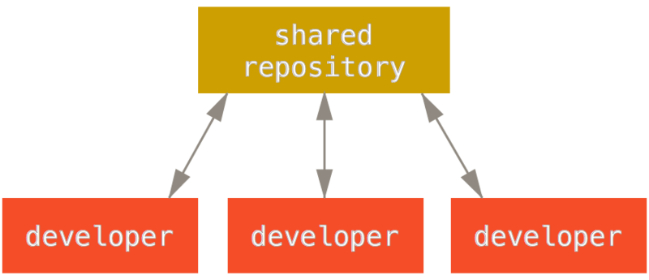
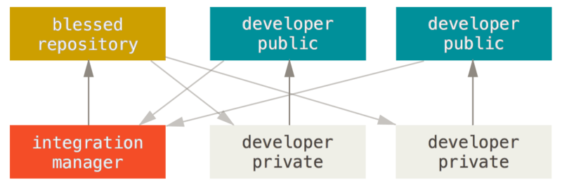
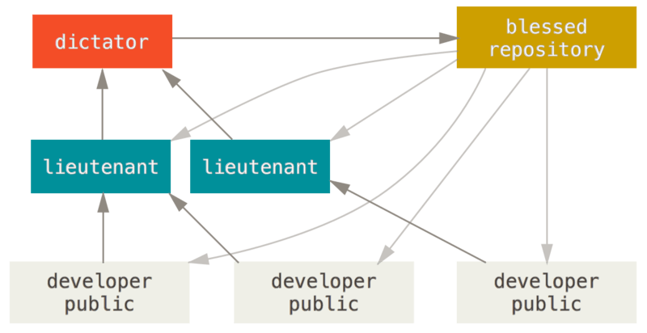

%  Git 工作流
% wkevin
% ZTE

# Workflow 工作流

## 工作流是一种约定

* 工作流是软件团队成员之间的约定
* 约定内容包括：
    - 对分支的定义
    - 对合并触发时机的定义
    - 对repo的分布、fork的定义
    - repo的人员分工的定义
    - 对权限的约定： 
        + git的分布式特性让“一个领导或管理员统管权限”变得无法操作
        + 可以适当运用gitlab等软件来约束权限，但它并不能解决所有问题

## 工作流因团队而异

* 不同的团队需要根据人员（能力、规模）、时间、发布策略等制定不同的工作流
    - 单机工作流
    - 小团队工作流
    - 分布式工作流
* 请在立项阶段就考虑 git 的工作流
* 可以在《版本构建说明》中详细描述本团队的工作流
* 请在每个sprint都审视工作流是否合适、运转正常

## 长期分支～特性分支

* 建议：
    - 不要为团队只定义一个master分支做长期分支
    - 请至少定义出这样几个长期分支：
        + 稳定、随时可发布的长期分支
        + 较稳定、供二次开发者或VIP用户使用的长期分支
        + 较稳定、供团队合并特性分支的长期分支
        + 不稳定的前沿长期分支
    - 特性分支的使用

# 单机工作流

# 分布式工作流

# Centralized Workflow 集中式工作流 

# Integration-Manager Workflow 集成管理者工作流 

## github/gitlab 的管理方式

[Understanding the GitHub Flow](https://guides.github.com/introduction/flow/)

# Dictator and Lieutenants Workflow 司令官与副官工作流 